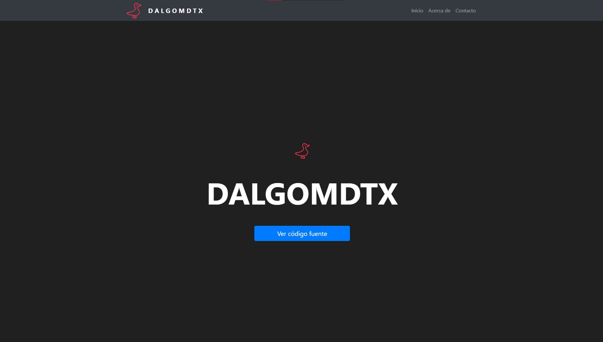

## Sitio Web con Nodejs y Express (ejs)

Repositorio de un pequeño proyecto -sitio web hecho con Nodejs y Express.
Código de fácil entendimiento con modulos generales /basicos de uso.



### Instalación

Primero, clonar el repositorio:

```sh
git clone https://github.com/dalgomdtx/nodejs-first-dalgomdtx.git
```

Ubicarse en la carpeta:

```sh
cd nodejs-first-dalgomdtx
```

Instalar dependencias:

```sh
npm install
```

Ejecutar el proyecto:

```sh
npm run dev
```

---

<p align="center">⭐️<a href="https://github.com/dalgomdtx"><b>DalgomdtX</b></a> :copyright: 2022</p>
